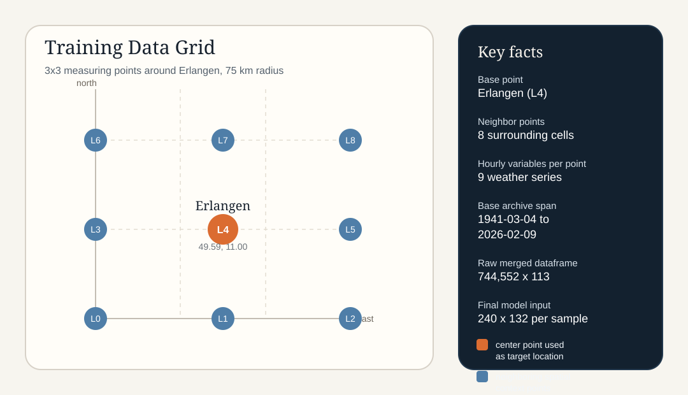
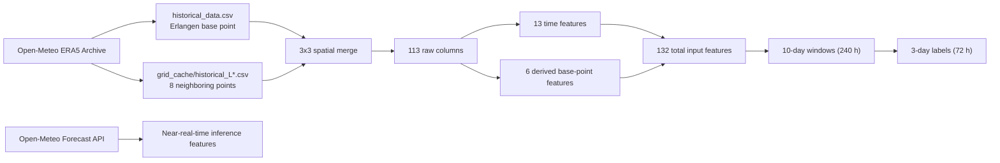
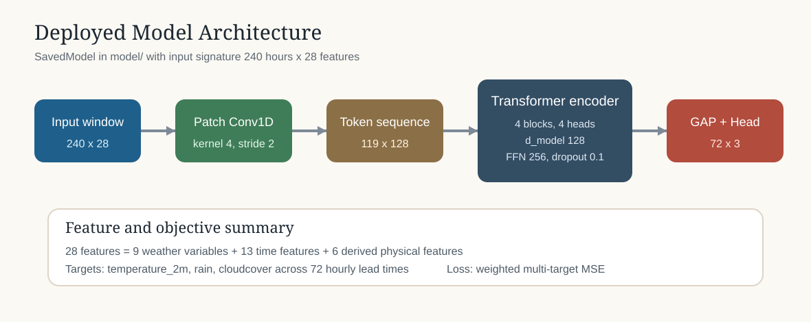
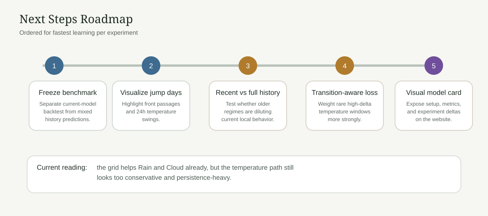
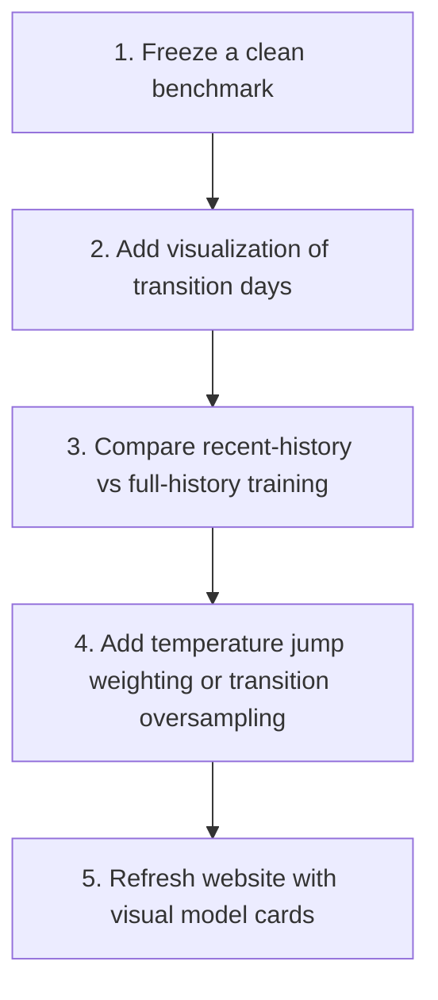

# ErlangenWeather Visual Overview

This document is the current visual briefing for the project. It is meant to answer three questions quickly:

1. What data do we train on?
2. How is the model set up?
3. What did we already try, and what should we do next?

## Current Snapshot

| Area | Current state |
|---|---|
| Base location | Erlangen, Germany (`49.59`, `11.00`) |
| Spatial setup | `3x3` grid, `75 km` radius, `9` measuring points total |
| Base archive span | `1941-03-04` to `2026-02-09` |
| Grid cache span | `L0/L1` through `2026-02-09`, `L2/L3/L5/L6/L7/L8` through `2026-02-08` |
| Hourly variables per point | `9` |
| Raw spatial dataframe | `744,552 x 113` |
| Final model input shape | `240 x 132` per training window |
| Forecast targets | Temperature, Rain, Cloud cover |
| Forecast horizon | `72` hours (`3` days) |
| Current experiment | `EXP-001`: add `3x3` spatial context |
| Latest evaluation vs baseline | Temp slightly worse, Rain improved, Cloud improved |

## Training Data

### Measurement Points

| ID | Role | Latitude | Longitude | dx (km) | dy (km) |
|---|---|---:|---:|---:|---:|
| `L0` | Southwest neighbor | `48.9143` | `9.9607` | `-75` | `-75` |
| `L1` | South neighbor | `48.9143` | `11.0000` | `0` | `-75` |
| `L2` | Southeast neighbor | `48.9143` | `12.0393` | `75` | `-75` |
| `L3` | West neighbor | `49.5900` | `9.9607` | `-75` | `0` |
| `L4` | Erlangen center point | `49.5900` | `11.0000` | `0` | `0` |
| `L5` | East neighbor | `49.5900` | `12.0393` | `75` | `0` |
| `L6` | Northwest neighbor | `50.2657` | `9.9607` | `-75` | `75` |
| `L7` | North neighbor | `50.2657` | `11.0000` | `0` | `75` |
| `L8` | Northeast neighbor | `50.2657` | `12.0393` | `75` | `75` |

### Feature Inventory

| Feature group | Count | Notes |
|---|---:|---|
| Hourly weather variables per point | `9 x 9 = 81` | `temperature_2m`, `relativehumidity_2m`, `pressure_msl`, `windspeed_10m`, `winddirection_10m`, `cloudcover`, `shortwave_radiation`, `precipitation`, `rain` |
| Static spatial features | `8 x 4 = 32` | `dx_km`, `dy_km`, `dist_km`, `bearing` for neighbors only |
| Time features | `13` | hour/day/month plus cyclic encodings and timestamp |
| Derived physical features | `6` | wind components, dew point, pressure tendency, previous-day temperature helpers |
| Total model input width | `132` | matches training log: `(240, 132)` |

## Model Architecture

```mermaid
flowchart LR
    A["Input window<br/>240 h x 132 features"] --> B["Conv1D patching<br/>kernel 4, stride 2"]
    B --> C["119 tokens x 128 dims"]
    C --> D["Transformer block 1"]
    D --> E["Transformer block 2"]
    E --> F["Transformer block 3"]
    F --> G["Transformer block 4"]
    G --> H["GlobalAveragePooling1D"]
    H --> I["Dense 216"]
    I --> J["Reshape 72 x 3"]
    J --> K["Targets<br/>Temp, Rain, Cloud"]
```

### Architecture Table

| Component | Value |
|---|---|
| Model family | Encoder-only Transformer with temporal patching |
| Input | `240 x 132` |
| Patching | `Conv1D`, kernel `4`, stride `2` |
| Token sequence after patching | `119 x 128` |
| Transformer depth | `4` blocks |
| Attention heads | `4` |
| Feed-forward width | `256` |
| Pooling | `GlobalAveragePooling1D` |
| Output head | Dense to `216`, reshape to `72 x 3` |
| Loss | `weighted_huber_multi` for `EXP-001` |
| Optimizer | `Adam`, learning rate `3e-4`, `clipnorm=1.0` |

## What We Did

| Stage | Outcome |
|---|---|
| Baseline single-point model | Established benchmark RMSE: Temp `3.171`, Rain `0.055`, Cloud `56.848` |
| Evaluation pipeline cleanup | Fixed multi-history parsing and added lead-bin scoring in `evaluation.py` |
| Spatial data caching | Added resumable per-location grid cache files under `grid_cache/` |
| Cache-only grid training | Added `--grid-cache-only` to train without redownloading |
| Keras 3 compatibility | Switched optimizer save/load path to modern Keras format |
| EXP-001 | Spatial `3x3` training completed and produced better Rain/Cloud RMSE, slightly worse Temp RMSE |

### Current Experiment Result

| Metric | Baseline | EXP-001 | Delta |
|---|---:|---:|---:|
| Temp RMSE (C) | `3.171` | `3.198` | `+0.027` |
| Rain RMSE (mm/h) | `0.055` | `0.052` | `-0.003` |
| Cloud RMSE (%) | `56.848` | `50.725` | `-6.123` |

Interpretation: the grid seems to help precipitation and cloud structure, but it does not yet solve the temperature conservatism that you observed.

## Next Steps

### Priority Table

| Priority | Task | Why it matters | Success signal |
|---|---|---|---|
| `P1` | Build an isolated backtest for the current model | Current history metrics mix predictions from different model versions | One-run, apples-to-apples RMSE per experiment |
| `P1` | Visualize temperature jump days | The current model appears conservative and persistence-heavy | We can inspect underpredicted front passages quickly |
| `P1` | Compare recent-history training vs full-history training | Older climate regimes may dilute current local dynamics | Better Temp RMSE without losing Rain/Cloud gains |
| `P2` | Add transition-aware loss weighting for temperature | Large temperature swings are underrepresented and get smoothed | Lower error on high-delta days |
| `P2` | Refresh `model_info.json` from code | The metadata file currently lags the actual code path | Site/docs stop drifting from reality |
| `P3` | Add a visual model card to the website | Faster feedback loop for future experiments | One page that shows data, model, metrics, and experiment deltas |

## Recommended Immediate Workflow

1. Use this document as the canonical project briefing.
2. Build the next experiment around a cleaner benchmark, not the mixed history files alone.
3. Add one dedicated visualization for extreme temperature transitions before changing the model again.

## Related Visuals

- Transition-day deep dive: [TEMPERATURE_TRANSITIONS.md](TEMPERATURE_TRANSITIONS.md)
