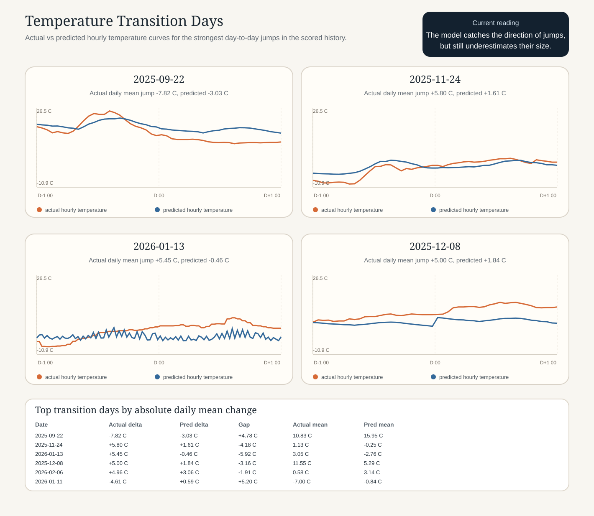

# Temperature Transition Brief

This note focuses on the days where Erlangen's daily mean temperature changed the most inside the scored prediction history.

## Reading guide

- Orange line: actual hourly temperature from `historical_data.csv`.
- Blue line: model prediction from `history_predictions.json`.
- Strong underreaction means the model is acting too much like persistence.

## Strongest transition days

| Date | Actual delta (C) | Pred delta (C) | Gap (C) | Comment |
|---|---:|---:|---:|---|
| 2025-09-22 | -7.82 | -3.03 | +4.78 | underreacted |
| 2025-11-24 | +5.80 | +1.61 | -4.18 | underreacted |
| 2026-01-13 | +5.45 | -0.46 | -5.92 | underreacted |
| 2025-12-08 | +5.00 | +1.84 | -3.16 | underreacted |
| 2026-02-06 | +4.96 | +3.06 | -1.91 | underreacted |
| 2026-01-11 | -4.61 | +0.59 | +5.20 | underreacted |

## Main takeaway

The current model usually gets the direction of major moves, but it compresses the amplitude. That is consistent with the conservative behavior already seen in the aggregate metrics.

## What to test next

1. Train on a more recent history window and compare these same transition days.
2. Add temperature transition weighting so large day-to-day changes matter more during training.
3. Score a dedicated jump-day benchmark alongside normal RMSE for every new experiment.